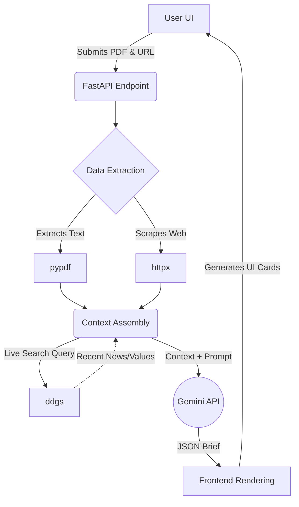

# Interview Prep Agent

A web application that turns a résumé (PDF) + a target job description URL into a tailored, research-backed **interview prep brief** — built with **FastAPI** and the **Gemini API**.

> *Submission for the Google × Kaggle 5-Day AI Agents Intensive — Vibe Coding Capstone (June 2026).*

---

## Demo Examples

You can test the agent with these sample inputs:

- **Demo Résumé (PDF):** [View Resume](https://drive.google.com/file/d/0ByQDS3_FTsMZNDBhOTE5MDUtZjE4OS00YzY4LWJlM2EtZGJlMGMyOTgyNWE5/view?resourcekey=0-i4IcGuebc2TJefD1rzvNmw)
- **Job Description URL:** [Software Engineer III, Google Cloud](https://www.google.com/about/careers/applications/jobs/results/74939955737961158-software-engineer-iii-google-cloud)

---

## The Problem

Interview prep is high-stakes and time-consuming. Candidates juggle three separate jobs at once: re-reading their own résumé to surface the right stories, researching the company's business and recent moves, and rehearsing structured (STAR) answers tailored to the role. Most people do this in scattered browser tabs the night before, and the result is generic.

This agent collapses that workflow into one run: give it your résumé and the job posting, and it produces a focused brief — company intel, the questions you're most likely to get, STAR answers grounded in *your actual experience*, and smart questions to ask back.

## How it works (Workflow)

The task is multi-step and utilizes various tools in sequence:

1. **Reading & Extraction:** Extracts structured text from the uploaded PDF résumé using `pypdf` and scrapes the job description from the target URL using `httpx`.
2. **Live Web Research:** Researches the company against the live web using `ddgs` (DuckDuckGo search) to fetch recent news and company values.
3. **Reasoning & Synthesis:** Feeds the extracted resume, scraped job description, and live web research into the **Gemini API** (`gemini-flash-latest`) to synthesize a structured, tailored interview prep brief.

## Architecture Diagram



## Tech Stack

- **Backend**: Python 3.10+, FastAPI, Uvicorn
- **Frontend**: Vanilla HTML/CSS/JS (Zero framework dependencies, sleek UI)
- **PDF Extraction**: `pypdf`
- **Web Scraping**: `httpx`
- **Search API**: `ddgs` (DuckDuckGo)
- **LLM Engine**: `google-generativeai` (Gemini Flash)

---

## Getting Started

### Prerequisites

- Python 3.10+
- A Google API key (for Gemini)

### Installation

1. **Clone the repository:**
   ```bash
   git clone https://github.com/Zaurezzh/kaggle_capstone_submission.git
   cd kaggle_capstone_submission
   ```

2. **Set up the environment (optional but recommended):**
   ```bash
   python -m venv venv
   # On Windows:
   venv\Scripts\activate
   # On Mac/Linux:
   source venv/bin/activate
   ```

3. **Install dependencies:**
   ```bash
   pip install -r requirements.txt
   ```

4. **Configure API Key:**
   Create a `.env` file in the root directory and add your Google Gemini API key:
   ```env
   GOOGLE_API_KEY=your_gemini_api_key_here
   ```

### Running the App

Start the FastAPI server:

```bash
uvicorn app:app --host 127.0.0.1 --port 8005 --reload
```
Navigate to `http://127.0.0.1:8005` in your browser. Upload your resume, paste the job posting URL, and generate your brief!
